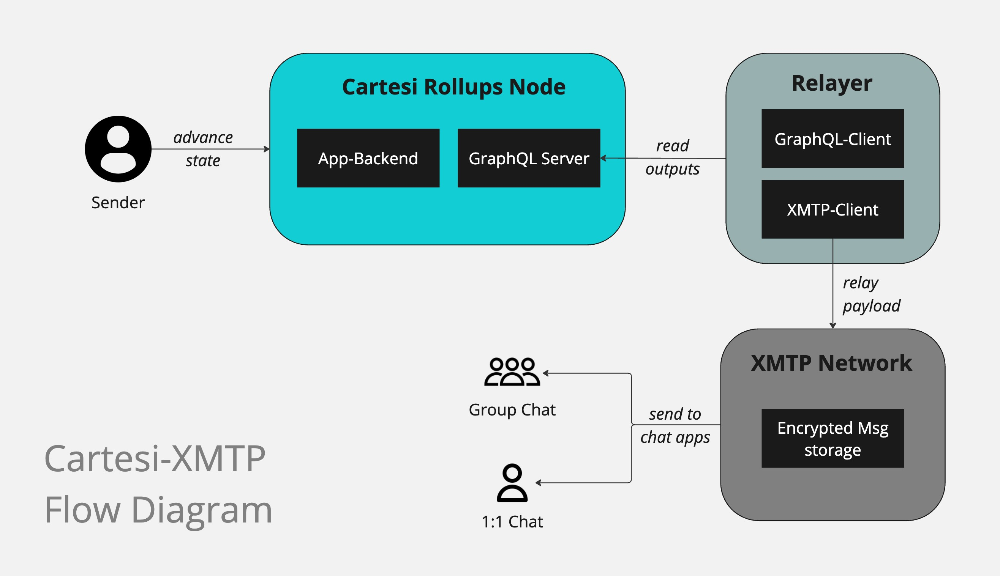

# XMTP-Cartesi Integration

This repository serves a simple Node.js server to spin up a boilerplate for integrating XMTP protocol to Cartesi Rollups dApps.

## Why use XMTP with Cartesi?

XMTP is a simple web3 message transport protocol that enables communication within wallets addresses. With this implementation dApps and users on cartesi can send out automated message in both bulk and single channel communications.

This can be applied in Games to notify players to return to the game to perform certain actions, In DAO's to notify members of new proposals, and a whole lot of other applications and usecases that we're looking to see you build.

## How does the architecture look?



## Steps to install and run

1. **Navigate to the Relayer Folder**

   - `cd` into the `relayer` folder.

2. **Install Dependencies**

   - Run the following command:
     ```bash
     npm install
     ```

3. **Set Up Environment Variables**

   - Create a `.env` file with the following details:
     ```
     PRIVATE_KEY    (This is the private key the server will use to relay messages)
     PRIVATE_KEY2   (This is the private key for the backup receiver the server uses)
     URI            (This is the Subgraph URI for your Cartesi backend)
     POOL_INTERVAL  (This is the time interval you intend for your server to fetch data from the graphql)
     ```

4. **Start the Server**

   - Run the following command:
     ```bash
     npm run dev
     ```

5. **Structure the Notice comming from your Cartesi dApp**

   - For the backend server to pick up and relay your message your dApp has to emit a notice that's structured in the below specific way.

     ```javascript
        {
            TxType: 'InAppMessage',
            Origin: 'sender address',
            Destination: 'receiver address',
            Payload: 'message to be sent',
        }
     ```

   - You cab replace the origin, destination and payload payload values according to yout requirements. you can also add other parameters to the notice if you intend to use them somewhere eles but only these sets of parameters will be picked yp by the server.
